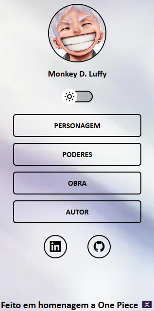
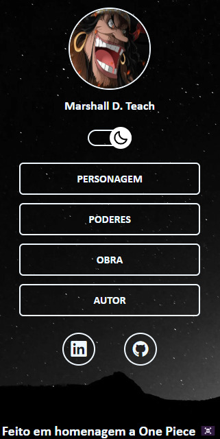

# Links Page

This project is a responsive links page designed to highlight important resources or references. It focuses on creating a visually appealing and user-friendly design while applying fundamental web development concepts.

     <a href="https://perfil-de-links-kts.netlify.app/">📱 Visit this Project</a> 

    
    

## Tech Stack

